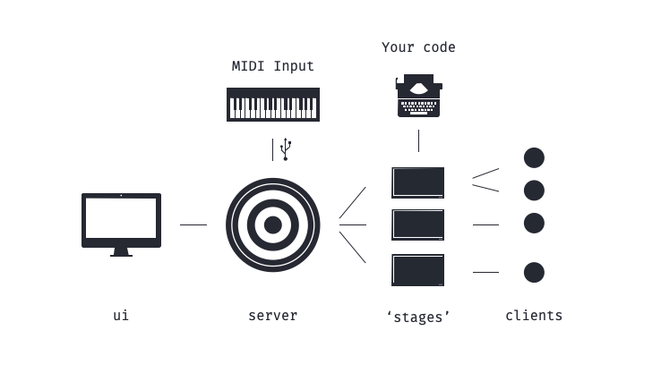

# solv.us

## What is solv.us?
Solv.us is an open-source, web-based & code-oriented framework for VJing & controlling interactive installations. It enables you to use the power of the web and existing frameworks for it like [three.js](https://threejs.org) in the context of live events, both in the physical word and online.

<p align="center">

</p>

### Server

### User Interface
The solv.us UI is the interface where you set up and control your project. It contains a workspace that is customizable with the elements that you need for your performance. 

### Stages


### Clients
Clients are instantiations of the stages. Think of it as the spectators.


## Getting started
### Setting up the server
Solv.us server runs in a Node.js environment, so make sure [Node.js](https://nodejs.org/en/) is installed on the computer you intend to run this server on. 

Download the latest version from [the Releases tab](https://github.com/solv-us/server/releases).
Alternatively, you can use npm:

```
npm install @solvus/server
```

Then, create a new file (e.g. index.js) where you import and setup the server:
```
import SolvusServer from './SolvusServer.js' // With ES6 imports
let SolvusServer = require('./SolvusServer.js'); // Or with require

let app = new SolvusServer();
```

To start the server, in the terminal navigate to your index.js file and run it with node:
```
node  /path/to/your/index.js
```

#### Note on HTTPS
Solv.us server is by default only accessible over HTTPS. To make things easier, it will generate the necessary certificate and key on start up and save them in the root folder. Browsers will not trust this certificate since it's self-signed, so in each browser you will need to trust it manually.

If you wish to provide your own certificate and key to prevent this, save them as ```./local-cert.pem``` and ```./local-key.pem``` in your root folder.

### Open the UI
To create new projects, you can use the online version of the user interface at [ui.sol.vus](ui.sol.vus).
If you don't want to rely on an internet connection, download it from the [UI repository](https://github.com/solv-us/ui) and serve it locally. 

In the UI you can set up stages, create MIDI mappings and.

### Add the client to your project
Head on over to the [client repository](https://github.com/solv-us/client) and integrate solv.us into your projects!

## Setup for development
If you want to add features or customize the server, you'll need to clone the whole repository and install its dependencies.

```
git clone https://github.com/solv-us/server.git
cd server
npm install
```

### Starting the server with auto reload
```
npm run start:watch
```

### Compile and minify for production
```
npm run build
```

## Directories

| Directory         | Purpose                                                              |
|-------------------|----------------------------------------------------------------------|
| /dist             | Containes minified and bundled script to use in production           |
| /public           | The folder exposed by the server                                     |
| /public/stage     | The stages                                                           |
| /src              | The source code of the server                                        |
